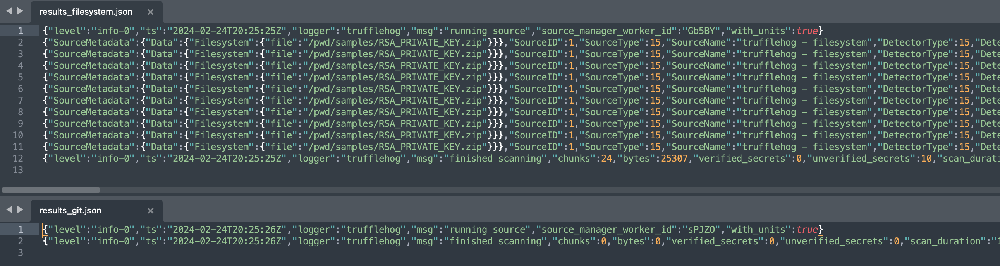
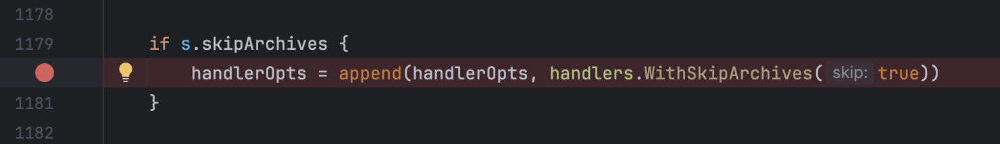

# Introduction
This repository documents trufflehog archive bugs which are present in TruffleHog secrets scanner, as 
reported in the following issues in the TruffleHog GitHub issue tracker:
* [#000 - Archive scanning behaviour is inconsistent depending on data source](https://github.com/trufflesecurity/trufflehog/issues/0000)

### Bug #??? - Archive scanning behaviour is inconsistent depending on data source

#### Description
File archive scanning behaviour differs depending upon which data source is specified. The default behaviour for the 
scanning of files on the local filesystem is to **_enable_** scanning of archives. However, for other data sources such 
as Git, the default behaviour is to **_disable_** the scanning of file archives.

This inconsistency in scanning behaviour means that not all data sources are treated equally and that different default 
behaviours are in place depending upon the source. This is not intuitive, nor is it documented, nor is it a desirable 
behaviour.

The default behaviour as of v3.63.7 is as follows:

| Data Source | skipArchives |
|-------------|--------------|
| CircleCI    | False        |
| Docker      | False        |
| FileSystem  | False        |
| GCS         | False        |
| _**Git**_   | _**True**_   |
| GitHub      | False        |
| GitLab      | False        |
| S3          | False        |
| SysLog      | False        |
| TravisCI    | False        |

When we compare findings for the [samples](./samples/) folder when scanned with the 'filesystem' and 'git' data sources 
we can see that the filesystem datasource scans and produces findings for the 10 secrets located in the zip file, 
however in the results from the scan which used the git data source we do not see this:

#### Affected versions
This behaviour was introduced in PR [#2257 - Add skip archive support ](https://github.com/trufflesecurity/trufflehog/pull/2257)
 which was merged on December 22nd 2024 and first appears in TruffleHog 
[v3.63.7](https://github.com/trufflesecurity/trufflehog/releases/tag/v3.63.7).

#### Root Cause

The default scanning behaviour for the git data source is configured to skip file archive on line 1180, in the file 
[/pkg/sources/git.go](https://github.com/trufflesecurity/trufflehog/blob/d53b83b58e37db1e58560a0ea5344470c054793f/pkg/sources/git/git.go#L1180).

This behaviour does not exist in any other data sources, nor is it configurable by the end-user. This behaviour is also 
not documented, and would not be expected by end-users.

